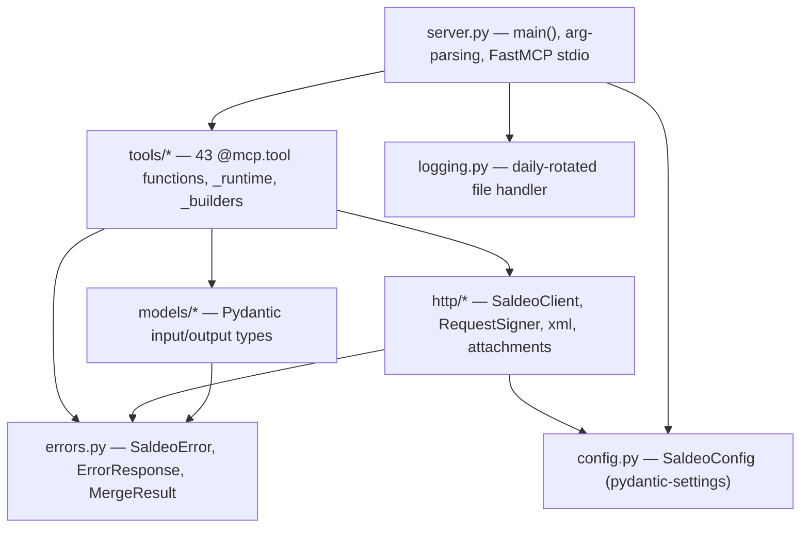
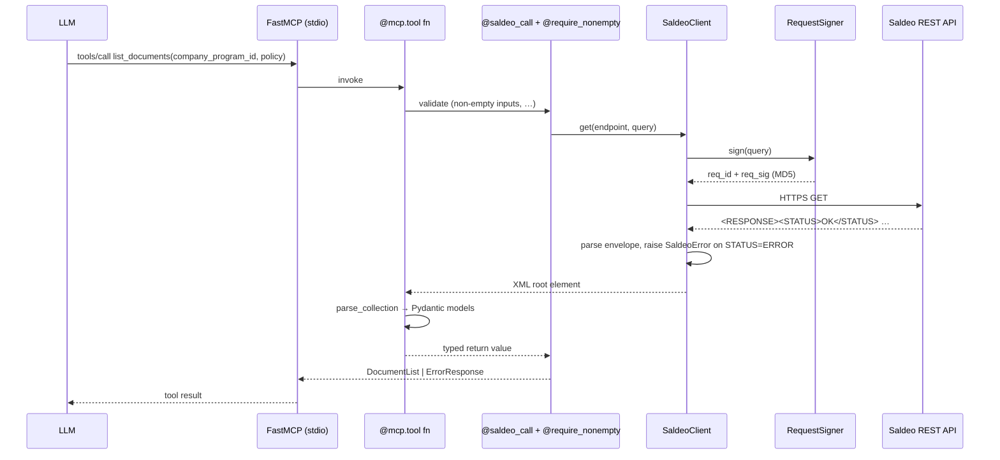
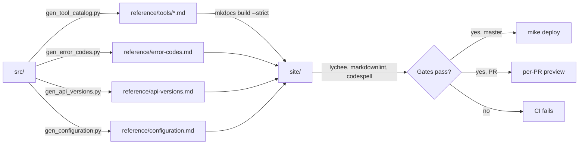

# Architecture

The package is a strict stack — each layer may import from layers below
it, never above. A test (`tests/unit/test_architecture.py`) parses every
import statement in the source tree and fails CI if anything reaches
upward.

## Layer stack



The architecture test asserts: no upward edge ever appears. If your new
module needs a helper from an upper layer, the helper belongs at or below
your layer instead.

## Source tree

```text
src/saldeosmart_mcp/
├── config.py          # SaldeoConfig (Pydantic Settings) — env vars, base URL
├── errors.py          # SaldeoError, ItemError, ErrorResponse, MergeResult,
│                      # iter_item_errors (per-item failure walker)
├── logging.py         # daily-rotated file logger (stdio is the MCP transport)
│
├── http/              # transport layer
│   ├── signing.py     # RequestSigner — MD5(URL-encode(sorted params) + token)
│   ├── client.py      # SaldeoClient — httpx pool + threading.Lock + envelope parser
│   ├── xml.py         # el_text/el_int/el_bool/set_text + URL redaction
│   └── attachments.py # Attachment + prepare_attachments — file → base64 + form
│
├── models/            # everything that crosses the MCP boundary as JSON
│   ├── common.py             # cross-resource: BankAccount(+Input), validated
│   │                         # string aliases IsoDate / Nip / Pesel / VatNumber,
│   │                         # range-bounded Year / Month
│   ├── companies.py          # Company, CompanySynchronizeInput, CompanyCreateInput
│   ├── contractors.py        # Contractor(+List), ContractorInput
│   ├── documents.py          # Document, DocumentAddInput, DocumentImportInput, …
│   ├── invoices.py           # InvoiceList, InvoiceIdGroups, InvoiceAddInput
│   ├── bank.py               # BankStatement(+List), BankOperation
│   ├── personnel.py          # Employee, EmployeeAddInput, PersonnelDocument, …
│   ├── financial_balance.py  # FinancialBalanceMergeInput
│   ├── accounting_close.py   # DeclarationMergeInput, AssuranceRenewInput, …
│   └── catalog.py            # CategoryInput, RegisterInput, ArticleInput, FeeInput, …
│
├── tools/             # @mcp.tool registry — one file per Saldeo resource
│   ├── _runtime.py           # mcp = FastMCP(...), saldeo_call, require_nonempty,
│   │                         # merge_call, get_client, summarize_merge, parse_collection
│   ├── _builders.py          # generic XML builders + append_close_attachments
│   ├── _documents_builders.py # document-tool XML builders
│   ├── endpoints.py          # one Final[str] constant per /api/xml/... path
│   ├── companies.py          # list_/synchronize_/create_companies
│   ├── contractors.py        # list_/merge_contractors
│   ├── documents.py          # list_/search_/add_/update_/delete_/recognize_/sync_/ …
│   ├── invoices.py           # list_/get_invoice_*, add_invoice
│   ├── bank.py               # list_bank_statements
│   ├── personnel.py          # list_/add_employees, list_/add_personnel_documents
│   ├── financial_balance.py  # merge_financial_balance
│   ├── accounting_close.py   # merge_declarations, renew_assurances
│   ├── dimensions.py         # merge_dimensions
│   └── catalog.py            # categories, payment_methods, registers, …
│
└── server.py          # main() — sets up logging, imports tools, runs mcp.run()
```

## Request lifecycle



## Highlights

- **Request signing** (`http/signing.py`) — Saldeo's MD5 contract: sort
  params, concatenate as `key=value` with no separator, URL-encode,
  append token, hash. Encapsulated in a single class — easy to test, easy
  to mock, the only place that ever sees the raw token.
- **Two request methods on `SaldeoClient`** — `get(path, query)` for
  endpoints whose request fits in URL params, and
  `post_command(path, xml_command, query, extra_form)` for endpoints with
  a structured body or file attachments. The split mirrors the Saldeo
  spec — both reads and writes can use either.
- **The `command` form field** carries gzip-compressed, base64-encoded
  XML. Saldeo signs over the *full request* (URL + form), so
  `post_command` hashes both together.
- **`threading.Lock`** in `SaldeoClient` serializes calls because Saldeo's
  spec forbids concurrent requests per user; FastMCP's thread executor
  would otherwise issue them in parallel. See
  [Concurrency](concurrency.md).
- **`SecretStr`** for the API token (never leaks via `repr()`/logs); URL
  redaction wipes `req_sig` and `api_token` from every logged URL. See
  [Security & privacy](security-and-privacy.md).
- **Per-item error walker** (`iter_item_errors` in `errors.py`) — Saldeo
  answers `STATUS=OK` at the envelope level even when individual batch
  items fail, so write tools call this and report partial successes via
  `MergeResult`.
- **Two-decorator boundary on write tools** — `@saldeo_call` maps
  `SaldeoError` / `FileNotFoundError` / `PermissionError` / `ValueError`
  to `ErrorResponse`; `@require_nonempty(field, message=...)` short-
  circuits empty-list batches before the network call. Stack
  `@require_nonempty` *under* `@saldeo_call`. The
  `merge_call(endpoint, xml, *, total, query, extra_form)` helper wraps
  the universal `post_command(...) → summarize_merge(...)` pair.
- **Validation at the MCP boundary** — write inputs are typed with
  `Annotated` aliases from `models/common.py` (`IsoDate`, `Nip`, `Pesel`,
  `VatNumber`, `Year`, `Month`); typos fail Pydantic validation
  client-side instead of returning an opaque Saldeo error code.

## Documentation pipeline

The docs site is itself derived from the source tree. Every PR runs:



The `tool-catalog-check.yml` workflow regenerates the catalog on every PR
that touches `src/saldeosmart_mcp/tools/**` and fails if the diff against
committed stubs is non-empty — code and docs cannot drift apart.
