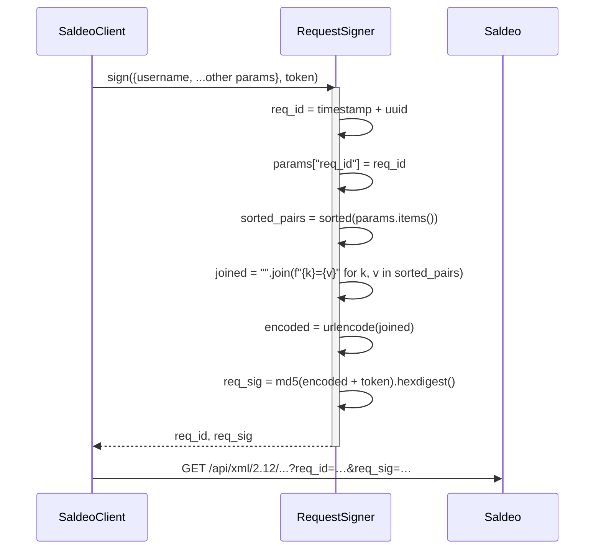

# Request signing

Every request to the SaldeoSMART API carries three auth params that must
be computed per-request: `username`, `req_id`, and `req_sig`. The
algorithm is dictated by Saldeo's spec; the implementation lives in
`src/saldeosmart_mcp/http/signing.py`.

## What goes into the signature

Saldeo's spec says: sort all request parameters by key, concatenate as
`key=value` with no separator, URL-encode the result, append the API
token, then MD5-hash the whole thing.

```text
sig = md5( url_encode( "".join(f"{k}={v}" for k, v in sorted(params.items())) ) + token )
```

For `GET` requests, "all parameters" means the URL query string.

For `post_command` calls (write endpoints), Saldeo signs over the
**entire** request — URL query plus form fields. The `command` form
field carries the request payload as gzip-compressed, base64-encoded
XML; that base64 string is part of the signature, so re-encoding it
between sign and send breaks the signature.

## Sequence



## Why MD5?

Not our choice — Saldeo's spec mandates MD5. The token itself is a
high-entropy random string (64 hex chars), and the signature is over
request-bound material (params + per-request `req_id`), so the
construction defends against replay and tampering even though MD5's
collision resistance is weak. We surface this in
[Security & privacy](security-and-privacy.md) as a known limitation.

## Why a class wraps it

`RequestSigner` is the **only** code path that reads
`SaldeoConfig.api_token`. The token never leaves that file unredacted —
not in logs, not in exception messages, not in `repr()` output (it's a
`pydantic.SecretStr`).

Encapsulating the algorithm makes it easy to:

1. Unit-test against fixtures from Saldeo's example XML.
2. Mock in integration tests so we never need a live token.
3. Audit the surface area for token handling — one file, one class.

## Common pitfalls

??? danger "Mutating params after signing"
    The signature is over the params *as signed*. If your code adds or
    removes a param after `sign()` returns, Saldeo will reject the
    request with `HTTP_401`. The `SaldeoClient` only ever signs the
    final, complete param dict.

??? danger "Re-encoding the command field"
    `post_command` gzips then base64-encodes the XML once, signs over
    that base64 string, and sends it verbatim in the `command` form
    field. Re-encoding (e.g. via `urllib.parse.quote` on the form field)
    will produce a different string than the one signed and Saldeo will
    reject it.

??? danger "URL-encoding before sorting"
    Sort first, then encode. URL-encoding can change the lexical order
    of keys (`%20` sorts before letters), which would shift the signed
    string and produce a different hash than Saldeo computes
    server-side.
